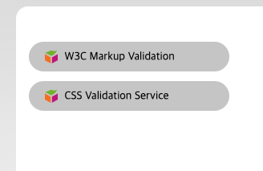
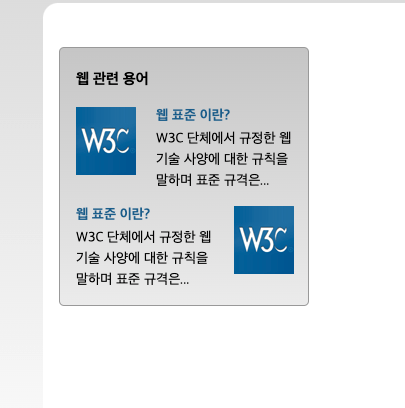

## Mission-01

- [General info](#general-info)
- [Results](#results)
- [Description](#description)

## General info

피그마로 주어진 Web Cafe 시안의 일부를 구현한 결과물입니다.

## Results

1. Validation



2. Term:



## Description

- Validation:
  ul태그 내에 2개의 li를 두고, background 이미지를 background-position과 padding을 사용하여 조정하였습니다.

```
ul.validation
│
├── li
│    └── a (href="/"): "W3C Markup Validation"
│
└── li
     └── a (href="/"): "CSS Validation Service"

```

- Term:

1. term.html(div 활용)
   빈 dt + 이미지가 들은 dd / 텍스트가 들은 div(dt+dd)로 분리하였고, 이미지가 들은 dd에만 float를 주고, clear 속성을 사용해서 플로팅을 해제시켰습니다.

```
div.term
├── h1
└── dl
    ├── div.term-list
    │   ├── dt
    │   ├── dd.left
    │   │   └── img
    │   └── div
    │       ├── dt
    │       └── dd
    └── dl
        ├── div.term-list
        │   ├── dt
        │   ├── dd.right
        │   │   └── img
        │   └── div
        │       ├── dt
        │       └── dd
```

2. term1.html(div 미활용. only dt+dd)
   이미지가 들은 dd / 텍스트만 이루어진 dt+dd로 분리하였고,각각 float속성을 주고 clear 속성을 사용해서 플로팅을 해제시켰습니다.

```
div.term
├── h1
└── dl.term-list
    ├── dt
    ├── dd
    └── dd.left
        └── img
└── dl.term-list
    ├── dt
    ├── dd
    └── dd.right
        └── img

```
