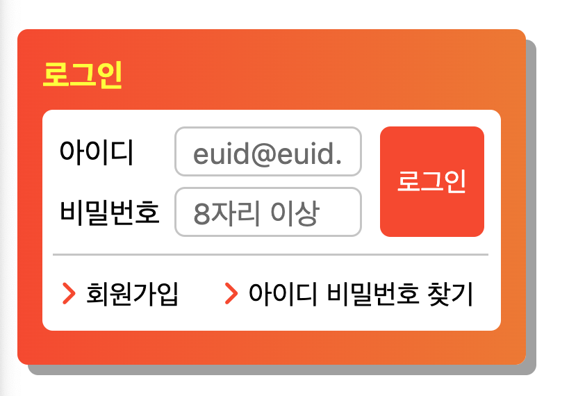

# Mission-02

- [Mission-02](#mission-02)
  - [General info](#general-info)
  - [Results](#results)
  - [Description](#description)

## General info

피그마로 주어진 Web Cafe 시안의 일부를 구현한 결과물.
그 중에서 로그인 폼부분입니다.

## Results

1. Login



## Description

- Login:
  section > h2 + form(fieldset과 ul)

  - fieldset > label(for=id) + input#id + label(for=password) + input#password + button
  - ul> li \* 2 > a  
    <br>

  fieldset(아이디와 비밀번호, 로그인)에서 label은 display: inline-block을 정렬하여 가로로 배치하였고, 로그인 버튼은 position: absolute, top과 right로 위치 조정하였습니다.

  ul(회원가입, 아이디 비밀번호 찾기)은 float:left를 적용후, margin-left를 활용하여 위치 조정하였습니다.

```
main
│
└─── section.login
     │
     ├─── h2.loginForm__title
     │
     └─── form.loginForm__contents
          │
          ├─── fieldset
          │    │
          │    ├─── label (for=id)
          │    │
          │    ├─── input#id.formInput__id
          │    │
          │    ├─── label (for=password)
          │    │
          │    ├─── input#password.formInput__password
          │    │
          │    └─── button.formInput__button
          │
          ├─── hr.divider
          │
          └─── ul
               │
               ├─── li
               │    │
               │    ├─── i.fas.fa-angle-right.icon--deco
               │    │
               │    └─── a (alt=회원가입)
               │
               └─── li
                    │
                    ├─── i.fas.fa-angle-right.fa-solid.icon--deco
                    │
                    └─── a (alt=아이디비밀번호찾기)


```
