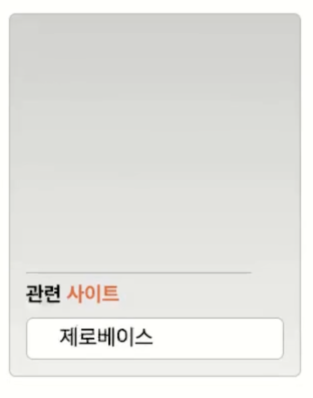

# Mission-03

- [Mission-03](#mission-03)
  - [General info](#general-info)
  - [Results](#results)
  - [Description](#description)

## General info

피그마로 주어진 Web Cafe 시안의 일부를 구현한 결과물.
그 중에서 관련 사이트 부분입니다.

## Results

1. Transition
   (이미지를 클릭하면 구현한 결과물 영상url로 이동합니다.)

[](https://youtube.com/shorts/L7nfI6OVmjw)

## Description

- HTML 돔 트리

```
main
└── div.event-and-site
    ├── section.event
    └── section.site
        ├── h2.site-title
        └── ul.site-contents
            ├── li
            │   └── a[href="https://zero-base.co.kr/"]
            ├── li
            │   └── a[href="https://developer.mozilla.org/ko/"]
            ├── li
            │   └── a[href="http://anystone.dothome.co.kr/Web/page/main.html"]
            ├── li
            │   └── a[href="https://www.webstandards.org/"]
            └── li
                └── a[href="https://www.w3.org/"]


```

- 마크업

  - site라는 section 내부에 h2로 제목을 두고, 링크 역할을 하는 사이트들을 ul > li\*5 > a로 마크업했습니다.

- 레이아웃
  - ul 태그에 a태그 요소 하나의 높이를 지정하고, overflow: hidden을 적용하여 기본적으로 1개의 리스트만 보일 수 있게 하였습니다.
  - a 태그로 display: block을 적용하여, 클릭가능한 영역이 넓게 하였습니다.
  - transition은 ul 자체에 hover시 height, padding-top, padding-bottom이 변화하게끔 레이아웃을 하였고, padding 부분은 시안상 height가 변화한 이후 변하는 것으로 보여 height의 duration시간 만큼을 padding에 지연시간으로 부여하였습니다.
