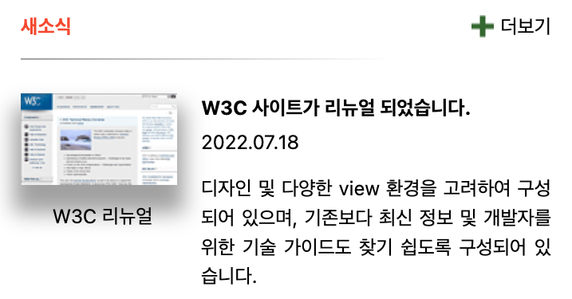
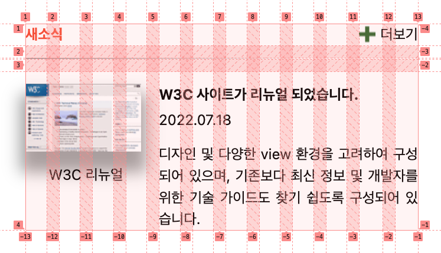

# Mission-04

---

- [Mission-04](#mission-04)
  - [General info](#general-info)
  - [Results](#results)
  - [Description](#description)

---

## General info

피그마로 주어진 Web Cafe 시안의 일부를 구현한 결과물.
그 중에서 새소식(그리드 활용) 부분입니다.

---

## Results

1. Grid




---

## Description

- HTML 돔 트리

```
main
└── section.news
    ├── h2.news-title
    ├── div.news-more-wrapper
    │   └── a.news-more
    │       └── img
    ├── div.divider[aria-label]
    ├── figure.news-image
    │   ├── img
    │   └── figcaption
    └── div.news-contents
        ├── h3
        ├── p
        └── p


```

- 마크업

  - grid container로 뉴스 섹션을 두고, 그 밑에 5개의 grid-area(title / more / divider / more / contents)로 분리하였습니다.
  - 웹 접근성 측면(스크린 리더를 위한 접근성 개선 요소)
    - "더보기"를 감싸는 div에 role="button"을 적용하였습니다.
    - divider div에 aria-label로 구분선임을 표시하였습니다.
    - figure 태그에 role="img"을 적용하였습니다.
    - contents div에 role="main"을 적용하였습니다.
    - contents의 날짜가 들어가는 숫자부분은 aria-label로 발행일임을 표시하였습니다.
    ```
      <section class="news">
        <h2 class="news-title">새소식</h2>
        <div class="news-more-wrapper" role="button">
          <a class="news-more"
            >더보기</a
          >
        </div>
        <div class="divider" aria-label="구분선"></div>
        <figure class="news-image" role="img">
          
          <figcaption>W3C 리뉴얼</figcaption>
        </figure>
        <div class="news-contents" role="main">
          <h3>W3C 사이트가 리뉴얼 되었습니다.</h3>
          <p aria-label="발행일">2022.07.18</p>
          <p>
            디자인 및 다양한 view 환경을 고려하여 구성되어 있으며, 기존보다 최신
            정보 및 개발자를 위한 기술 가이드도 찾기 쉽도록 구성되어 있습니다.
          </p>
        </div>
      </section>
    ```

- 레이아웃

  - 그리드
    - container
      ```
       .news{
        display: grid;
        grid-template-columns: repeat(12, 1fr);
        grid-template-rows: auto;
        gap: 12px;
        grid-template-areas:
          "title title . . . . . . . . more more"
          "divider divider divider divider divider divider divider divider divider . . ."
          "image image image image contents contents contents contents contents contents contents contents";
          }
      ```
    - item: area 5개
      ```
       .news-title {
         grid-area: title;
       }
       .news-more-wrapper {
         grid-area: more;
       }
       .divider {
         grid-area: divider;
       }
       .news-image {
         grid-area: image;
       }
       .news-contents {
         grid-area: contents;
       }
      ```
  - 기타

    - 공통되는 부분은 변수로 처리해봤습니다.
      (font-size, line-height)

      ```
      :root {
      --main-font-size: 14px;
      --main-line-height: 150%;
      }

      main {
        font-size: var(--main-font-size);
        line-height: var(--main-line-height);
      }
      ```
