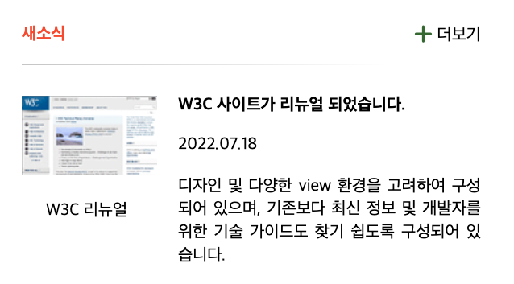
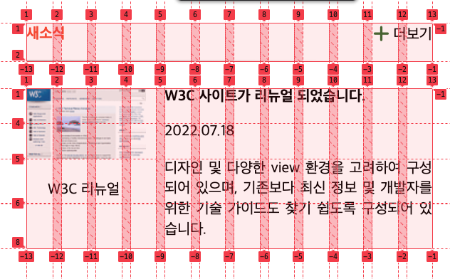

# Mission-04

- [Mission-04](#mission-04)
  - [General info](#general-info)
  - [Results](#results)
  - [Description](#description)

## General info

피그마로 주어진 Web Cafe 시안의 일부를 구현한 결과물.
그 중에서 새소식(그리드) 부분입니다.

## Results

1. Grid




## Description

- HTML 돔 트리

```
main
└── section.news
    ├── div.news-title-wrap
    │   ├── div.news-title-sub-wrap
    │   │   └── h2.news-title
    │   └── div.news-plus
    │       └── i.fa-sharp.fa-solid.fa-plus.fa-lg.font-deco
    └── article.news-contents-wrap
        ├── img.news-contents-image
        ├── div.news-contents-image-title
        ├── div.news-contents-subject
        ├── div.news-contents-createdAt
        └── div.news-contents-description


```

- 마크업

  - news라는 section 내부에 구분선을 기준으로 위는 news-title 관련 div, 아래는 news-contents 관련 div로 구성되어 있습니다.
  - news-contents는 기사의 성향에 가깝다고 느껴서 article로 그룹핑하였습니다.

- 레이아웃
  - news-title 관련 div / news-contents 관련 div를 나눠서 grid를 적용하였습니다.
  - grid는 공통적으로 column을 1fr단위로 12개로 나누고, gap으로 0.5rem만큼의 간격을 두었습니다. 이후 그리드 라인 번호는 정수로 지정해야 하기에, 세부적인 위치 조정은 margin이나 padding을 사용하였습니다.
