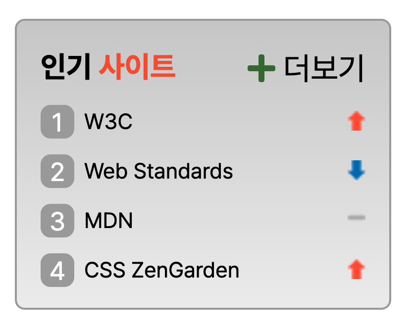

# Mission-05

---

- [Mission-05](#mission-05)
  - [General info](#general-info)
  - [Results](#results)
  - [Description](#description)

---

## General info

피그마로 주어진 Web Cafe 시안의 일부를 구현한 결과물.
그 중에서 인기사이트(스프라이트) 부분입니다.

---

## Results

1. Sprite



---

## Description

- HTML 돔 트리

```
main
└── section.favorite
    └── div.favoriteWrapper
        ├── h2.favorite__title
        │   ├── "인기"
        │   └── span
        │       └── "사이트"
        ├── ol.favorite__contents
        │   ├── li.sprite.spriteW3C
        │   │   └── a[href="https://www.w3.org/"]
        │   │       └── "W3C"
        │   ├── li.sprite.spriteWS
        │   │   └── a[href="https://www.webstandards.org/"]
        │   │       └── "Web Standards"
        │   ├── li.sprite.spriteCZG
        │   │   └── a[href="https://www.csszengarden.com/"]
        │   │       └── "CSS ZenGarden"
        │   └── li.sprite.spriteMDN
        │       └── a[href="https://developer.mozilla.org/"]
        │           └── "MDN"
        └── a.favorite-more
            ├── span.fas.fa-plus.accentSite
            └── "더보기"


```

- 조건

  - rank.png 이미지를 활용하여 스프라이트 기법으로 스타일링 한다.
  - 각 인기 사이트의 순위를 나타내는 영역은 기존 <ol> 요소에서 제공하는 기본 숫자를 보이지 않도록 한 후 CSS로 구현한다.

- 마크업

  - favorite라는 section내에 h2 + ol + a 태그를 div로 감싸주었습니다.
  - aria-hidden = "true"를 사용하여 스크린리더(보조기기)가 접근하지 않고, 시각적으로만 보여지게 하였습니다.
    ```
      <section class="favorite">
        <div class="favoriteWrapper">
          <h2 class="favorite__title">인기 <span>사이트</span></h2>
          <ol class="favorite__contents">
            <li class="sprite spriteW3C">
              <a href="https://www.w3.org/">W3C</a>
            </li>
            <li class="sprite spriteWS">
              <a href="https://www.webstandards.org/">Web Standards</a>
            </li>
            <li class="sprite spriteCZG">
              <a href="https://www.csszengarden.com/">CSS ZenGarden</a>
            </li>
            <li class="sprite spriteMDN">
              <a href="https://developer.mozilla.org/">MDN</a>
            </li>
          </ol>
          <a class="favorite-more" title="인기사이트">
            <span class="fas fa-plus accentSite" aria-hidden="true"></span>
            더보기
          </a>
        </div>
      </section>
    ```

- 레이아웃

  - 리스트 스타일

    - ol에 counter-reset: list-counter; 속성을 부여하여 리스트 아이템에 번호를 붙이기 위해 사용된 CSS 카운터를 초기화 하였습니다.
    - list에 list-counter라는 카운터를 통해 각 아이템에 번호를 부여하고, 가상 요소 선택자인 before에 content로 counter를 지정하였습니다.
    - list 번호 위치를 조정하기위해, list에 position: relative; list:before에 position: absolute를 주어 위치를 조정하였습니다.
      ```
      .favorite__contents {
        display: flex;
        flex-direction: column;
        justify-content: space-between;
        list-style: none;
        counter-reset: list-counter;
        margin-top: 8px;
        height: 92px;
        position: relative;
      }
      .sprite {
        height: 17px;
        line-height: 17px;
        counter-increment: list-counter;
        position: relative;
        padding-left: 22px;
        font-size: 11px;
      }
      .sprite:before {
        content: counter(list-counter);
        position: absolute;
        left: 0;
        width: 13px;
        height: 13px;
        font-weight: 400;
        font-size: 13px;
        line-height: 150%;
        background: #a3a3a3;
        padding: 2px;
        border-radius: 5px;
        display: inline-block;
        color: white;
        text-align: center;
        line-height: 14px;
      }
      ```

  - rank 이미지 스프라이트
    - HTML과 CSS의 관심사를 분리한다는 차원에서, list 자체에 background 속성을 부여 조정하기보단, after 가상 요소 선택자를 통해 각 리스트 아이템 뒤에 배경 이미지를 표시하였습니다.
    - after 요소에 position을 absolute로 세부적인 위치조정을 하였습니다.
    - 스프라이트 기법으로 background-position 조정을 위해 별도의 클래스를 만들어 시안과 맞는 이미지부분을 보여주게끔 조정하였습니다.
    ```
    .sprite:after {
      content: "";
      display: inline-block;
      position: absolute;
      top: 3px;
      right: 0;
      background: url(./images/rank.png) no-repeat;
      width: 9px;
      height: 10px;
    }
    .spriteW3C:after {
      background-position: 0 0;
    }
    .spriteWS:after {
      background-position: 0 -45px;
    }
      .spriteCZG:after {
      background-position: 0 0;
    }
    .spriteMDN:after {
      background-position: 0 -23px;
    }
    ```
